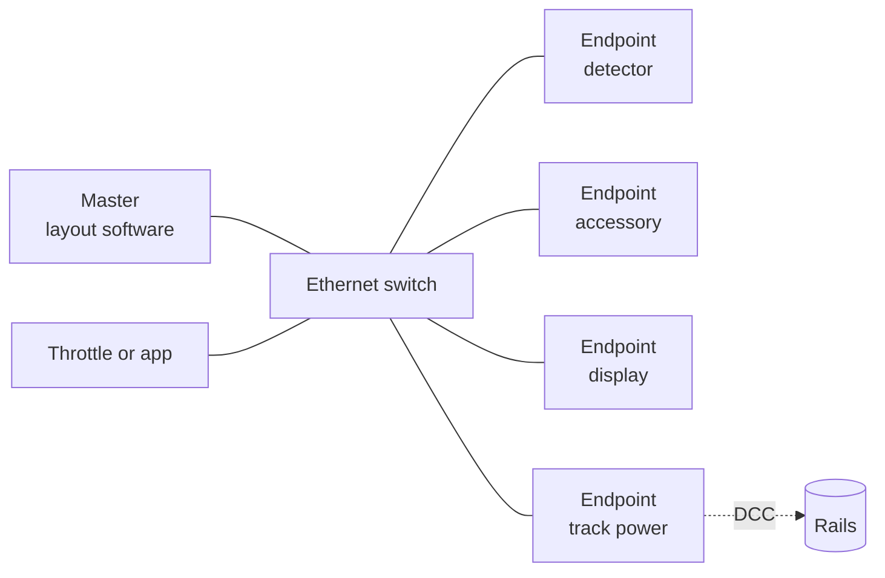

# MRRoIP-1: Model Railroad over IP — Core Protocol and Device Profiles

**Status: DRAFT** · Sep 18, 2026 · @Thierry

> **This is a draft.** Section numbers, field names and wire details may still change, and nothing here
> should be treated as stable enough to build a product against without tracking the repository. The
> implementations in this repository and in the `esp32` applications are the only ones known to exist, and
> where they disagree with this text, one of the two is a bug.

## Status of This Document

This document is a **draft specification**. It is not a standards-track document of the NMRA, MOROP, SMPTE or any other recognised body, and no such body has reviewed it. Distribution is unlimited.

This document is licensed **CC-BY-4.0**, and anyone may implement what it describes — in software or hardware, commercially, with no permission, royalty or registration (`LICENSE-SPEC`). The reference implementation is licensed separately, under Apache-2.0. The name `MRRoIP` is reserved for implementations that pass the conformance suite of Appendix A.

It specifies the protocol and nothing else. Device profiles are separate documents, published independently and on their own schedule; none is normative here, and this specification must be implementable without reading any of them.

Sections 1 to 13 are **normative**. Section 14 is normative for profile authors. Sections 15 and 16 and Appendices A to C are informative, except where Appendix A states the conditions a conformance run must satisfy.

### Abstract

MRRoIP (Model Railroad over IP) is an application protocol for controlling stationary model railway equipment over ordinary IP networks. It specifies device identity, discovery, self-description, configuration, control and state reporting for a class of devices called **endpoints**, commanded by one or more **masters**. Device-specific behaviour is confined to separately published **profiles**; the core protocol names no kind of device.

MRRoIP defines **no device categories**. It does not distinguish locomotives from accessories: what a device is follows from the objects, modes and parameters it declares, not from which part of the protocol addresses it. The protocol generates no track power and specifies no track-signal packet format, and is designed to coexist with existing systems rather than to replace them.

## 1. Introduction

Model railway accessory control still runs on buses designed between 1989 and 2005. The dominant ones — s88, LocoNet, XpressNet, R-Bus, CAN variants — are position-addressed or address-assigned, are limited in device count, carry a few bits per device, and each belongs to one manufacturer's ecosystem. Devices on them cannot describe themselves, so every vendor ships its own configuration tool and every master must be updated before it can configure a device it has not seen.

MRRoIP starts from a different assumption: that the layout already has, or can trivially have, an IP network. Commodity Ethernet switches, patch cable and Power over Ethernet are cheaper per port than any proprietary bus interface, have no device ceiling at layout scale, and carry enough bandwidth for payloads that existing buses cannot represent at all — images, audio and video streams.

### 1.1 Design Goals

1. **One kind of device.** The protocol has endpoints, and nothing else. The distinction between a locomotive and an accessory is not represented anywhere in it.
2. **Identity without assignment.** A device is identified by its MAC address. Nothing is numbered by the installer, and inserting a device mid-installation renumbers nothing.
3. **Self-description.** An endpoint publishes a machine-readable description of its objects, modes and parameters. A master that has never seen a device type can still discover it, read its configuration, display its state and stop it.
4. **A small core.** The protocol defines no device types. Everything device-specific lives in a profile, and the test of the core is that a new profile can be written without amending it.
5. **Commodity infrastructure.** Standard switches, standard cable, standard PoE. The specification defines no cabling, no connector and no bus topology.
6. **Coexistence.** MRRoIP does not generate the track signal. It is designed to sit alongside DCC, and gateways to existing accessory buses are expected.

### 1.2 Relationship to Existing Systems

| System | Overlap with MRRoIP | Difference |
| --- | --- | --- |
| NMRA DCC | None at the wire level | DCC carries locomotive and accessory commands on the rails. MRRoIP carries neither |
| s88 / s88-N | Feedback reporting | s88 is a polled shift register addressed by position. MRRoIP endpoints report by identity and may report unsolicited |
| LocoNet, XpressNet, R-Bus | Accessory and feedback control | Single-vendor buses with device ceilings and assigned addresses |
| BiDiB | Self-describing nodes, hot-plug, an Ethernet interface | Closest in intent. BiDiB runs on RS-485 with an IP interface at the head; MRRoIP is IP end to end |
| OpenLCB / LCC | Self-description via CDI, peer-to-peer, no assigned addresses | LCC standardised this model on CAN in 2016. MRRoIP differs in transport, not in ambition, and adds media payloads |

MRRoIP claims no novelty for self-description. LCC's Configuration Description Information solved the same problem on a different transport, and the design here should be read as that idea carried onto IP.

### 1.3 No Device Categories

DCC inherits its structure from the analogue era. Multi-function decoders and accessory decoders are separate packet types with separate address spaces, separate configuration semantics and separate commands; feedback is a third system again, on a different bus entirely. The consequences are structural, not cosmetic: a turnout cannot have a speed, a locomotive cannot report occupancy, an address means a different thing depending on which space it is in, and a master needs three object models to describe one layout.

That division was a consequence of what the rails could carry, and of an era in which a locomotive was a motor and an accessory was a coil. Neither constraint survives on an IP network, and carrying the division forward only imports the complexity it caused.

MRRoIP therefore has **one kind of device**. An endpoint declares its objects, its modes and its parameters; whatever category a human would put it in follows from that declaration. A locomotive is an endpoint whose objects include a vehicle with a speed setpoint. A turnout is an endpoint with an output. A detector is an endpoint with inputs. A display is an endpoint with a bitmap. All four are discovered the same way, configured the same way, commanded the same way, and report the same way.

The only thing the core knows about the nature of a device is `device_class` (Section 4.2), and that is a **safety property** rather than a category: it says what must not keep happening when the master goes quiet. It carries no implication about what the device is for, and two devices a modeller would call entirely different things may share a class.

### 1.4 Out of Scope

Track power generation, booster protection behaviour, DCC and other track-signal packet formats, cabling, connectors, mechanical form factors, and the electrical characteristics of any device.

No kind of device is out of scope. An endpoint that travels along the layout is described by the same grammar as one bolted under the baseboard, and the core has carried the case since rev 1.0: `device_class: mobile` exists for it, and its timeout rule is written for a device under a throttle. Which devices get built first is a commercial question and is answered nowhere in this document.

## 2. Conventions Used in This Document

### 2.1 Requirements Language

The key words **MUST**, **MUST NOT**, **REQUIRED**, **SHALL**, **SHALL NOT**, **SHOULD**, **SHOULD NOT**, **RECOMMENDED**, **MAY** and **OPTIONAL** are to be interpreted as described in RFC 2119.

### 2.2 Notation

Monospace identifiers such as `/definition`, `device_class` and `estop` are protocol literals and are case-sensitive. JSON fragments are illustrative unless introduced as normative. Field tables list the owner of each field as **Core** or **Profile**; a master MUST NOT assume the meaning of a Profile-owned field it does not recognise.

### 2.3 Encoding

All protocol bodies are JSON, UTF-8, without a byte-order mark. Every response MUST carry `Content-Type: application/json`. An endpoint MUST accept request bodies up to 4096 bytes and MUST reject larger bodies with `413 body_too_large`, except on paths the endpoint declares with a larger \`max\_bytes\` under Section 7.5. An endpoint MUST operate correctly with both `Connection: close` and HTTP keep-alive.

### 2.4 Protocol Name Binding

The protocol name appears in an SSDP search target, an HTTP header prefix, JSON fields, an mDNS service type and filenames. An implementation MUST define each spelling exactly once:

```c
/* proto_name.h — the ONLY place the protocol name is spelled. */
#define MRROIP_NAME     "MRRoIP"      /* human-readable         */
#define MRROIP_TOKEN    "mrroip"      /* lowercase, identifiers */
#define MRROIP_VERSION  "0.1"         /* draft revision spoken  */
#define MRROIP_UDP_PORT 5300
#define MRROIP_SSDP_ST  "urn:schemas-mrroip-org:device:Endpoint:1"
#define MRROIP_MDNS_SVC "_mrroip"     /* + "._tcp"              */
```

## 3. Terminology

| Term | Definition |
| --- | --- |
| **Endpoint** | One addressable device on the layout. One MAC address, one identity, one `/definition` |
| **Master** | Anything that sends control messages: layout software, a throttle, a script |
| **Profile** | The device-type-specific half of the specification. Section 14 states what a profile document must define |
| **Object** | A named thing inside an endpoint that `/control` addresses: a lamp, an axis, a cabin, a signal head, an image, a detection result |
| **Parameter** | A named setting inside an endpoint that `/config` addresses |
| **Authority** | Which master, if any, is currently commanding the endpoint (Section 11) |
| **Desired state** | What a control message carries. Never a transition (Section 9.1) |
| **Device class** | The value governing behaviour on loss of the master (Section 4.2) |

**Objects and parameters are distinguished by which resource sets them, and by nothing else.** Everything else follows from that. Objects are commanded, so authority and the control timeout apply to them and `estop` acts on them (Section 11), and they change many times a second over UDP. Parameters are configured, so they are validated, versioned and stored (Section 8); no timeout alters one, and a signal changing aspect costs no flash cycle.

The split falls where intuition expects: speed is an object and acceleration rate a parameter, occupancy is an object and debounce time a parameter, a detection is an object and the zone that produced it a parameter. Where intuition and the resource disagree, the resource decides.

An endpoint containing several objects is still **one** endpoint. A decoder driving eight turnouts is not eight endpoints; it is one endpoint with eight objects. Identity is per device because identity is per MAC address, and the distinction becomes material as soon as anything is configured.

## 4. Architecture

### 4.1 System Model

Masters and endpoints communicate over an IP network. There is no command station in the protocol: a master is ordinary software on ordinary hardware, and an endpoint is a network device. Track power, where required, is produced by a device that is itself an endpoint, but the protocol defines nothing about how it produces it.



A master discovers endpoints (Section 6), reads their descriptions (Section 7), configures them (Section 8), commands them (Section 9) and observes their state (Section 9.6). Nothing in the protocol requires a master to be present; an endpoint's behaviour without one is fixed by its device class.

### 4.2 Device Classes

Every endpoint MUST declare exactly one `device_class`. It is the single point at which the core protocol needs to know anything about the nature of the device, and it is the hook on which the control timeout of Section 11.3 hangs.

| `device_class` | Meaning | On loss of the master |
| --- | --- | --- |
| `mobile` | Travels along the layout under a master's direction | **Stops.** Nothing else is safe |
| `stationary` | Fixed in place. May move a load on its own schedule | **Resumes autonomous operation**, or comes to rest if it has none |
| `passive` | Moves nothing with momentum | Holds its last state |

A profile fixes its class; an endpoint MUST NOT choose one at runtime. If a device genuinely fits none of the three, the correct response is a fourth class in this document, not a special case in a profile.

### 4.3 Conformance

A **conformant endpoint** implements Sections 5 through 13 in full, plus exactly one profile. A **conformant master** MAY use any subset of the protocol, but MUST NOT assume anything a profile has not declared in `/definition`.

A master that understands the core but not an endpoint's profile MUST still be able to discover the device, read its configuration, read its state and issue `estop`. Emergency stop on a layout cannot be conditional on whether the software has been updated for a device it has never seen.

## 5. Network and Transport

### 5.1 Identity

| Field | Rule |
| --- | --- |
| `device_id` | The Wi-Fi **station** MAC, lowercase hex, colon-separated: `a0:b7:65:12:34:56`. On ESP-IDF, `esp_read_mac(mac, ESP_MAC_WIFI_STA)`. Never the AP MAC, which differs. Immutable, and MUST NOT be settable through `/config` |
| `device_name` | Free text, at most 31 characters. A **label, never an identifier**. Two endpoints MAY share one until a user renames one of them |
| `device_type` | The profile's identifier, e.g. `"turntable"`, `"cablecar"`, `"display"`. Lowercase, no spaces |
| `device_class` | Section 4.2 |
| `profile_version` | The profile revision the firmware implements |
| `firmware` | Semantic version from a build-time definition |

A client that renames a device MUST still be able to find it by MAC afterwards. If renaming changed identity, every master's stored reference would break the first time a user typed a friendlier name.

### 5.2 Network Attachment

An endpoint MUST obtain an IP address and be reachable on it. How it does so is an implementation matter and is not specified here: DHCP or static, Ethernet or Wi-Fi, credentials supplied by whatever means the implementer prefers.

One requirement does follow, because it is observable from outside: every service of Section 5.3 MUST be available however the endpoint joined the network, and an implementation MUST NOT make any of them conditional on a particular attachment mode. An endpoint that speaks the protocol only once it is on a configured network cannot be tested on a bench, and cannot be diagnosed when the network is the thing that is broken.

Conventions that have proved useful in practice — a fallback access point when no credentials are stored, a captive portal for entering them, a naming scheme for the temporary SSID, retry counts and timeouts — belong in an implementation guide published alongside this document, not in it.

### 5.3 Ports

| Service | Port | Note |
| --- | --- | --- |
| HTTP | 80 | All request/response paths. An endpoint MAY serve on another port — a second endpoint on one host, a test run without privileges — and then MUST carry it in the SSDP `LOCATION`, the mDNS SRV record and the whois reply, whose `definition` becomes a full URL (`http://192.168.1.47:8080/definition`) |
| Control | UDP 5300 | Configurable. Bound to `0.0.0.0`; accepts broadcast |
| SSDP | UDP 1900 | Multicast `239.255.255.250` |
| whois probe | UDP 8266 | Diagnostic (Section 6.3) |
| mDNS | 5353 | Convenience (Section 6.2) |

### 5.4 Transport Choice

HTTP is the authoritative transport: every path is reachable over it. UDP carries `/control` with a byte-identical body, for masters that repeat desired state at rate. A control message MUST produce the same result on either transport, and an implementation MUST route both through a single parser (Section 13.1).

## 6. Discovery

### 6.1 SSDP — Normative

An endpoint MUST announce `ssdp:alive` at start-up **three times, 100 ms apart**, then every `announce_interval_s` (default 300, minimum 30). UDP multicast is lossy and the start-up announcement is the one that matters. It MUST respond to `M-SEARCH` for `ssdp:all` or for the MRRoIP search target after a random delay of 0 to `MX` seconds, and SHOULD send `ssdp:byebye` on a clean reboot.

```
NOTIFY * HTTP/1.1
HOST: 239.255.255.250:1900
CACHE-CONTROL: max-age=600
LOCATION: http://192.168.1.47/definition
NT: urn:schemas-mrroip-org:device:Endpoint:1
NTS: ssdp:alive
USN: uuid:mrroip-a0b765123456::urn:schemas-mrroip-org:device:Endpoint:1
SERVER: esp-idf/5.2 MRRoIP/0.1
X-MRROIP-ID: a0:b7:65:12:34:56
X-MRROIP-NAME: drehscheibe
X-MRROIP-TYPE: turntable
X-MRROIP-CLASS: stationary
```

`LOCATION` MUST point at `/definition` directly, not at a UPnP device description. MRRoIP does not use UPnP's XML document, and implying otherwise would oblige every implementer to serve one.

The four `X-MRROIP-*` headers let a master build a device list without fetching anything. On a layout with sixty endpoints that is the difference between a discovery pass costing one multicast round trip and one costing sixty HTTP requests.

**Rate limiting and recovery.** A master MAY silence announcements with `POST /config {"announce_interval_s": 0}`. If announcements are disabled **and** no `/control` or `/config` traffic has been seen for 30 minutes, the endpoint MUST re-enable them at the default interval. A layout whose master has gone away must become discoverable again without a power cycle.

### 6.2 mDNS — Convenience, Not Protocol

An endpoint SHOULD advertise `_mrroip._tcp` on its HTTP port with TXT records `id`, `name`, `type`, `class` and `fw`, and SHOULD set its hostname so that `<device_name>.local` resolves. This exists so a person can type a name into a browser. **Nothing in the protocol may depend on it**: a conformance run MUST pass with mDNS compiled out.

### 6.3 whois Probe — Diagnostic

An endpoint SHOULD listen on UDP 8266 and, on a datagram whose payload contains `"whois"`, reply to the sender:

```json
{"proto":"MRRoIP","v":"0.1","id":"a0:b7:65:12:34:56","name":"drehscheibe",
 "type":"turntable","class":"stationary","ip":"192.168.1.47","definition":"/definition"}
```

Consumer mesh routers and guest networks silently block client-to-client multicast. When SSDP finds nothing there is otherwise no way to distinguish a missing device from a blocked one, which is the worst class of failure to place in front of a non-technical owner. This is a diagnostic aid, not a second discovery mechanism.

## 7. Device Description — `GET /definition`

The endpoint's self-description: what it is, what it contains, what it accepts, and every configurable parameter with type, default, range and unit. This is the resource that makes a generic master possible.

An implementation MUST generate this document from the same table that validates `/config` writes. One `static const param_desc_t params[]`, walked once to emit JSON and once to validate. Two hand-maintained lists diverge within a week, and a master that trusts a stale `/definition` is worse than one with none.

The resource is cacheable. An endpoint SHOULD send an `ETag` derived from firmware version, profile version and `config_version` — the document carries `device_name` and the UDP port, so a configuration write must change it — and serve `304`.

The example below describes a **turntable**, deliberately: a core document illustrated with one of its own profiles quietly acquires that profile's assumptions.

```json
"objects": [
  { "id": "bridge", "type": "int",
    "min": 1, "max": 24, "unit": "track" },
  { "id": "lamp", "type": "enum",
    "values": ["off", "on"], "default": "off" },
  { "id": "aligned", "access": "state", "type": "bool",
    "confirms": "bridge" }
]
```

Two commanded objects and one observed. The third is the end-switch reading, and `confirms` (Section 9.7) tells a master it verifies the bridge rather than being a second thing to set.

```json
{
  "proto": "MRRoIP",
  "proto_version": "0.1",

  "device_id": "a0:b7:65:12:34:56",
  "device_name": "drehscheibe",
  "device_type": "turntable",
  "device_class": "stationary",
  "profile_version": "1.0",
  "firmware": "0.1.0",

  "endpoints": {
    "definition": "/definition",
    "config": "/config",
    "control": "/control",
    "state": "/state",
    "objects": "/objects/{id}",
    "udp_control_port": 5300,
    "icon": "/ui/device.svg"
  },

  "capabilities": {
    "autonomous": true,
    "commanded": true,
    "reporting": true,
    "telemetry_hz": 5,
    "modes": ["operate", "park"],
    "core_modes": ["estop", "reset", "release", "hold"],
    "languages": ["en", "de"]
  },

  "objects": [
    { "id": "bridge", "type": "int", "min": 1, "max": 24, "unit": "track" },
    { "id": "lamp", "type": "enum", "values": ["off", "on"], "default": "off" },
    { "id": "aligned", "access": "state", "type": "bool", "confirms": "bridge" }
  ],

  "parameters": [
    { "name": "device_name", "type": "string", "default": "drehscheibe",
      "max_len": 31, "persist": true },
    { "name": "control_timeout_ms", "type": "int", "default": 2000,
      "min": 500, "max": 30000, "unit": "ms", "persist": true },
    { "name": "udp_port", "type": "int", "default": 5300,
      "min": 1024, "max": 65535, "persist": true },
    { "name": "announce_interval_s", "type": "int", "default": 300,
      "min": 0, "max": 86400, "unit": "s", "persist": true }
  ],

  "ui": {
    "bridge": { "label": "Bridge", "icon": "/ui/bridge.svg", "group": "Movement" },
    "lamp":   { "label": "Pit lamp", "icon": "/ui/lamp.svg",
                "value_labels": { "off": "Off", "on": "On" } },
    "aligned": { "label": "Bridge aligned" },
    "device_name": { "label": "Name", "group": "General" },
    "control_timeout_ms": { "label": "Control timeout", "group": "Network",
                            "advanced": true,
                            "doc": "How long the bridge keeps taking orders after the last message." },
    "udp_port": { "label": "UDP port", "group": "Network", "advanced": true },
    "announce_interval_s": { "label": "Announce every", "group": "Network",
                             "advanced": true }
  }
}
```

### 7.1 Core Versus Profile Content

| Field | Owner |
| --- | --- |
| `proto`, `proto_version`, `endpoints` | Core, fixed |
| `device_id`, `device_name`, `firmware` | Core |
| `device_type`, `device_class`, `profile_version` | Profile declares, core carries |
| `capabilities.core_modes` | Core, fixed. Exactly `estop`, `reset`, `release`, `hold` (Section 9.3) |
| `capabilities.modes` | Profile. Its own modes, never repeating a core one (Section 9.2) |
| `capabilities.reporting` | Core, present only where the endpoint reports unsolicited (Section 9.7) |
| `capabilities.autonomous`, `.commanded`, `.telemetry_hz` | Profile |
| `objects[].id` and its value description | Profile declares them; the value description follows Section 7.2 |
| `objects[].profile` | Profile, opaque to core. A master that does not know the type ignores it |
| `parameters[]` | The four core parameters above are mandatory; the profile appends its own |

### 7.2 Parameter Declaration

Each entry of `parameters[]` MUST carry `name`, `type`, `default` and `persist`. Numeric parameters MUST carry `min` and `max`; string parameters MUST carry `max_len`. A `unit` SHOULD be given wherever one exists, so that a master can render and validate sensibly rather than presenting a bare integer. A `doc` string MAY be supplied for display.

An enumerated value is `"type": "enum"` with `values`, a list of the permitted strings. This is the same declaration a `switch` object uses for its states (Section 7.3), and a master validates and renders both identically.

A parameter MAY be a **list**, in one of two shapes, and the declaration says which:

- **Fixed length** — `"type": "int[]"` with `"count": 16`. Every element is always present, and the declared range, unit and default apply to each. Per-channel settings are this shape: sixteen debounce times are one parameter with a count of 16, not sixteen parameters, and without it `/definition` becomes unreadable on any device with more than a few channels.
- **Variable length** — `"type": "int[]"` with `"max_count"`, and `"min_count"` where a shorter list would be meaningless. The length is part of the value. A detection polygon, a set of zones, a list of waypoints.

A write supplies the **whole list**. There is no element-wise patch, for the same reason a control message carries a desired state rather than a change (Section 9.1): a whole value is idempotent, and a lost or duplicated message leaves nothing half-applied.

An element MAY be a record, declared as `"type": "object[]"` with `fields`, each field described by the same grammar as a parameter:

```json
{ "name": "zones", "type": "object[]", "max_count": 8, "persist": true,
  "fields": [
    { "name": "label",     "type": "string", "max_len": 16 },
    { "name": "polygon",   "type": "int[]",  "min_count": 6, "max_count": 32, "unit": "px" },
    { "name": "threshold", "type": "float",  "min": 0.0, "max": 1.0, "default": 0.6 }
  ] }
```

A master renders that as a table of eight rows and three columns without knowing what a zone is. Records SHOULD NOT contain further records: one level keeps every master's renderer simple, and a device needing more structure than that is telling you it wants an interface of its own (Section 7.4) or a resource of its own (Section 7.5).

A value MAY take one of several shapes, declared as `"one_of"`, a list of alternatives, in place of `type`. Each alternative is a declaration in this grammar without a `name`; the value is accepted when any alternative accepts it. A stream that is started with a record and stopped with a word is the case that needs it:

```json
{ "id": "stream", "one_of": [
    { "type": "object", "fields": [
        { "name": "port", "type": "int", "min": 1024, "max": 65535, "default": 5004 },
        { "name": "format", "type": "enum", "values": ["rgb565be", "rgb"] } ] },
    { "type": "enum", "values": ["off"] } ] }
```

Alternatives MUST differ in their JSON type — a string and a record, not two records — so that a value matches one of them at most and a master knows which form it is looking at. Alternatives MUST NOT themselves be `one_of`. A master renders a choice between the forms, and the field of the form chosen. Where no alternative accepts a value, the reason given is that of the alternative with the value's JSON type, and `wrong_type` if there is none.

Reported values follow the same declaration. An `input` object whose value is a variable-length list — the detections in the current frame, say — declares `max_count` so that a master can size what it allocates and what it draws before the first report arrives.

`persist` in a declaration says whether the endpoint can store that parameter at all. A parameter declared `"persist": false` is deliberately volatile — a test aid, or a value only meaningful while running — and returns to its default after a power cycle. Whether a particular write is stored is the writer's choice (Section 8.2).

A parameter that takes effect only when the endpoint restarts declares `"applies": "restart"` — a panel type, a pin assignment, anything the endpoint reads once while bringing up. A master uses it to warn before writing and to show that a restart is pending (Section 8.1).

### 7.3 Objects

A property list with types and ranges is enough for a master to **render** a device it has never seen. It is not enough to **drive** one. A master that knows only `speed: float 0.0–1.0` cannot know it is looking at a moving train, so it cannot brake it at a signal, hold it on an occupied block, or stop it when something goes wrong — and automation is the reason most masters exist.

An object is identified by `id` and otherwise **described by exactly the same grammar as a parameter** — `type`, `min`, `max`, `unit`, `default`, `values`, `count`, `fields`, `one_of`, all of Section 7.2. It differs in two ways only, and both are optional.

`access` is `control` by default. An object declared `"access": "state"` is observed and reported but never commanded: a detector input, a measured current, a detection result. It is an object rather than a parameter because it changes at run time and travels with the rest of the state.

The objects and parameters lists stay separate because they behave differently at run time: objects are commanded or reported continuously and are subject to authority, the timeout and `estop`, while parameters are set occasionally, validated, versioned and stored. But a master renders both in one interface from one declaration, so a range is written the same way in either list.

A value too large to travel in a control message — an image, an audio buffer — is declared with `"type": "resource"` naming an entry under `endpoints` (Section 7.5), or is uploaded as the object's binary state (Section 9.8). The control message then carries the identity of what was uploaded, not the bytes.

**Devices compose from objects; they are not types.** A locomotive is an endpoint with one `motion` object and some `switch` objects. A maintenance vehicle is that same endpoint plus an `axis` for the boom, a `scalar` for the work light and a `switch` for the outriggers — and any master that understands `motion` still drives it as a locomotive without knowing what a crane is. This is precisely what DCC cannot express: there, a crane becomes F5 for up and F6 for down, because on and off are the only vocabulary available.

It is also why functions are not booleans. A three-state coupler, a smoke generator with an intensity and a sound module with a volume are all functions on a real model, and only one of them is a boolean.

The core knows nothing else about any value. Whether a float between 0 and 1 is a locomotive's speed or a sound module's volume is not represented here, and a master that must tell them apart learns it from `device_class` (Section 4.2) and from the profile.

### 7.4 Endpoint-Served User Interface

An interface on the endpoint is usually **not** a home for things the protocol cannot hold. It is a pleasanter way to set the same declared parameters.

A camera doing object detection is the useful example. Its region of interest is a list of coordinates (Section 7.2), its confidence threshold a scalar, its model an enumeration, its detections an `input` object reported as they happen — every one of them declared in `/definition`, readable and writable through `/config` by any master that has never heard of a camera. And the endpoint can still serve a page where the user drags the region over a live preview instead of typing eight numbers. Both routes reach the same parameters; only one of them is bearable.

Occasionally something genuinely resists description: a sample library, an interactive calibration, a preview that only means anything while it is moving. Extending the grammar until it covered those would defeat the purpose of Section 7.

An endpoint MAY therefore serve its own user interface from its own HTTP server, and declares it as `ui` in `endpoints`:

```json
"endpoints": { "definition": "/definition", "config": "/config",
               "control": "/control", "state": "/state", "ui": "/ui" }
```

A master that finds `ui` SHOULD offer it, as a link or embedded, so that a user reaches it from the device list rather than by hunting for an address. The mDNS name of Section 6.2 serves the same purpose for a person with only a browser.

One rule keeps this from undoing everything else, and it is the point of the section:

**Nothing a master needs may be reachable only through the UI.** Every parameter declared in `/definition` MUST be readable and writable through `/config`. Any state a master acts on MUST appear in `/state`. `estop` MUST work without it. The UI is for what the grammar cannot express, never for what a vendor would rather keep to itself — a device whose essential configuration lives behind a web page has reproduced the per-vendor configuration tool this specification exists to abolish.

The protocol reserves `/definition`, `/config`, `/control`, `/state` and any path a profile declares. Everything else on the endpoint's HTTP server belongs to the implementer, and a master MUST NOT assume a UI is present.

### 7.5 Additional Resources

`endpoints` is an **open map, not a fixed list**. An endpoint MAY declare any further paths it serves, and a master MUST ignore entries it does not recognise. This is what lets a device offer bulk transfer, a file store, a stream source, a firmware path or a diagnostic dump without any of them having to be invented in this document — and it is why the core needs no extension procedure.

The names whose meaning is fixed here are `definition`, `config`, `control`, `state`, `udp_control_port` and `ui`. Every other name belongs to the profile or to the implementer.

An entry's value is either a path, or an object carrying the path and whatever a master needs in order to use it:

```json
"endpoints": {
  "definition": "/definition",
  "config": "/config",
  "control": "/control",
  "state": "/state",
  "ui": "/ui",

  "image_upload": { "path": "/objects/image", "methods": ["PUT"],
                    "content_type": "application/octet-stream",
                    "max_bytes": 262144,
                    "doc": "Whole frame, or a tile-aligned rectangle." },
  "detections":   { "path": "/events", "methods": ["GET"] }
}
```

A declared resource MAY accept bodies larger than the 4096-byte limit of Section 2.3 where its declaration says so through `max_bytes`. The limit applies to the reserved paths regardless, so a master can always size a request to a device it knows nothing about.

The rule of Section 7.4 carries over unchanged: a declared resource MUST NOT be the only route to something a master needs. A master that implements the reserved names and nothing else MUST remain able to discover, configure, observe and stop the device.

### 7.6 Extending Sparingly

Sections 7.4 and 7.5 exist because no grammar describes everything, not because they are a convenient place to put things. An implementer SHOULD use them only for what this specification genuinely cannot express, and MUST NOT use them for anything it can.

The test is worth applying honestly: **can this be an object or a parameter with a type and a range?** If it can, it MUST be one. A detection threshold is a scalar property however much else the camera needs a page for. A turnout's throw time is a property, not a field on a web form. Reaching for a private path because it is quicker than declaring a parameter is how a standard becomes decorative.

What is at stake is not tidiness. Anything behind a private path or a private page is invisible to every master except the one its author wrote. A device declaring three properties and hiding the rest behind a web interface conforms to the letter of this document and is unusable in anybody else's software: it has become the per-vendor configuration tool this specification exists to abolish, now wearing a conformance badge.

Where several implementers find themselves declaring the same extension, that is evidence of a gap rather than of cleverness. A reserved name or a property that three vendors have each invented privately SHOULD be proposed for this document or for a profile shared between them, instead of being re-invented a fourth time.

### 7.7 Presentation

Presentation lives in its own `ui` section of `/definition`, keyed by the `id` of an object or the `name` of a parameter — both called *name* in the rest of this section. The two share one namespace: an object and a parameter MUST NOT have the same name. Nothing about how a device looks appears in the declarations themselves.

The separation is what makes localisation and theming possible at all. `name` is an identifier — it is what a master matches on, what a control message carries, and what must survive translation — so it MUST NOT be shown to a user. The `ui` section is the part that changes with language, with a redesign, or with a master's preferences, and it can be replaced wholesale without touching a single declaration.

Every entry is optional, and a master MUST render correctly with no `ui` section at all, falling back to names.

| Key | Meaning |
| --- | --- |
| `label` | Short human text: "Bridge", "Pit lamp" |
| `value_labels` | For an enum, a map from each permitted value to its label |
| `doc` | A sentence or two, for help text or a tooltip |
| `icon` | A path to an SVG file the endpoint serves |
| `group` | Gathers related entries under one heading. Order within a group is declaration order |
| `advanced` | `true` hides it until the user asks for detail |

The endpoint's own icon is `icon` under `endpoints`, alongside its other resources, since it belongs to the device rather than to anything inside it.

`group` and `advanced` are what make a generated interface bearable on a device with forty parameters, and they cost the implementer one word each. A device whose defaults work should present three settings and hide the rest.

**Icons are SVG files served by the endpoint.** A device knows what it looks like and no central registry of icon names has to be maintained, extended or argued over; a master that has never seen the device type still draws the right thing. An icon SHOULD be a single monochrome path using `currentColor` so that a master can colour it to its own theme and it works in both light and dark, and SHOULD stay under a few kilobytes.

A standard icon set MAY be published alongside this specification, and implementers are encouraged to use it so that interfaces look coherent. It is a convenience, not part of the standard: nothing validates an icon, and an endpoint that serves none is fully conformant.

**Translations do not belong in the endpoint.** A controller costing a few tens of euros should not carry a dozen languages in flash, a vendor cannot translate into all of them, and adding Norwegian should not require a firmware release. So this specification fixes the **key** and the **format**, and leaves the source open.

`name` is the key — which is the reason it must never be shown to a user, and the reason it must not change when a label does. A catalogue maps names to presentation for one language, for one device type and profile version:

```json
{
  "proto": "MRRoIP",
  "device_type": "turntable",
  "profile_version": "1.0",
  "lang": "de",
  "ui": {
    "bridge": { "label": "Bühne" },
    "lamp":   { "label": "Grubenlampe",
                "value_labels": { "off": "Aus", "on": "Ein" } },
    "control_timeout_ms": { "label": "Steuerungs-Timeout",
                            "doc": "Wie lange die Bühne nach der letzten Nachricht weiter Befehle annimmt." }
  }
}
```

The `ui` block inside is exactly the shape of the one in `/definition`, deliberately: a catalogue **is** a `ui` section in another language, and a master merges it over the one the endpoint served. Entries it lacks fall through; entries for names the device does not have are ignored.

A master resolves each label in this order and stops at the first hit:

1. a catalogue for the user's language
2. the `ui` section the endpoint served — optionally requested with `Accept-Language`, where `capabilities.languages` says the endpoint holds more than one; the first entry in that list is what it serves by default
3. the `name` itself

**Where a catalogue comes from is not specified, and that is the point.** An endpoint MAY serve one as a `labels` resource under `endpoints`. A master MAY ship catalogues for the devices it knows. A vendor MAY publish them. A community MAY maintain them for devices whose vendor never will. Because the key is stable and the format is fixed, a translation written by someone who has never met the manufacturer still works, and a new language costs nobody a firmware update.

Two things are never translated: a `unit`, which is machine data a master may need to convert, and an enum `value`, which is itself a key. Only their labels change. And a master MUST work with no catalogue at all.

**Presentation never carries meaning.** A master MUST NOT infer behaviour from a label, a group or an icon: everything it acts on comes from the value description of Section 7.2. If it did otherwise, changing the display language would change what the layout does.

## 8. Configuration

### 8.1 `GET /config`

Returns the running value of every parameter, plus `_meta`.

```json
{
  "device_id": "a0:b7:65:12:34:56",
  "config": { "device_name": "drehscheibe", "control_timeout_ms": 2000 },
  "_meta": { "config_version": 7, "dirty": true, "dirty_keys": ["control_timeout_ms"],
             "restart_pending_keys": [] }
}
```

| `_meta` field | Meaning |
| --- | --- |
| `config_version` | MUST increment on every accepted write. The concurrency token |
| `dirty`, `dirty_keys` | The running value differs from the stored one: written without `persist`, and lost at the next power cycle |
| `restart_pending_keys` | Parameters declared `"applies": "restart"` whose stored value is not yet the one running |

### 8.2 `POST /config` — Commit Semantics

```json
{ "control_timeout_ms": 4000, "persist": true, "if_version": 7 }
```

| Rule | Behaviour |
| --- | --- |
| Application | Applies to the running system immediately, except a parameter declared `"applies": "restart"` |
| Persistence | `"persist": true` stores every key of the write, and it survives a power cycle. Without it the write applies to the running system only and is reported in `_meta.dirty_keys`: a master can try a value and discard it with a restart. There is no separate commit step; re-writing the same values with `persist` is the commit |
| Restart parameters | A key declared `"applies": "restart"` MUST be written with `persist`, otherwise `requires_persist`: a value that is neither running nor stored could never take effect. Where the stored value then differs from the one running, the endpoint restarts **after** the response is sent |
| Volatile parameters | A parameter declared `"persist": false` is never stored and returns to its default on reboot |
| Atomicity | **All keys or none.** Validate everything first; on any failure apply nothing and list **every** offending key, not only the first |
| Unknown keys | Rejected, `400`. Silently ignoring them makes a typo look like success |
| Concurrency | `if_version` optional. Present and not equal to `config_version` gives `409 version_conflict` with the current config |
| Reserved | `persist`, `if_version` and `factory_reset` are control keys, never parameters |
| Response | `200`, body identical to `GET /config` |
| Side effects | A change altering transport takes effect **after** the response is sent. A change to `device_name` re-announces SSDP and re-registers mDNS |

A rejected key carries a `reason`: `unknown_key`, `wrong_type`, `out_of_range` (with `min` and `max`), `too_long` (with `max_len`), `not_allowed` (an enumeration, with `values`) or `requires_persist`.

An endpoint SHOULD write storage only when the value actually changes, since a master re-sending an identical configuration must not cost a flash cycle.

```json
{ "error": "validation_failed",
  "applied": false,
  "details": [
    { "key": "control_timeout_ms", "reason": "out_of_range", "min": 500, "max": 30000 },
    { "key": "contrl_timeout",     "reason": "unknown_key" }
  ] }
```

`"applied": false` MUST be stated explicitly rather than implied by the status code. A partial application the client does not know about is the worst outcome available here.

**Factory reset.** `POST /config {"factory_reset": true}` erases the namespace and reboots.

### 8.3 Persistence

One NVS namespace, `mrroip` — or on a host with a file system, one file per endpoint holding the same keys. One key per persisted parameter, named identically to the parameter, so the mapping needs no table; where the store limits key length (NVS: 15 characters) the implementation abbreviates, and records the mapping next to the parameter table. In addition:

| Key | Purpose |
| --- | --- |
| `cfg_ver` | `config_version`, surviving reboot |
| `wifi_ssid`, `wifi_pass` | Credentials |

An implementation MUST NOT write flash from a timer callback or directly from an HTTP handler thread; such writes MUST be queued. Any counter a profile persists MUST be rate-limited — flash wear is measured in write cycles, not in years.

## 9. Control and State

### 9.1 Desired State, Not Transitions

Every control message carries the **desired state**. `{"objects":{"drive":{"speed":0.4}}}` means *"I want you travelling at 0.4"*, not *"accelerate now"*. Re-sending it while already doing so MUST change nothing.

This is a consequence of the repeat requirement: a master holds authority by repeating its message at 1 Hz or faster, and a message meaning "start" cannot survive that — sent ten times it would start ten things. Recovery from packet loss is then free, because the next repeat re-establishes the correct state without the master tracking what was missed.

It is also why `/control` and `/state` share a vocabulary: the master asks for what it wants in exactly the terms the endpoint reports back.

### 9.2 The Control Message

`POST /control`, and the byte-identical JSON as a UDP datagram to the control port:

```json
{ "seq": 1043, "ts": 88123, "mode": "operate",
  "objects": { "bridge": 7, "lamp": "on" } }
```

| Field | Required | Meaning |
| --- | --- | --- |
| `seq` | yes | Monotonic per master. Echoed. Detects loss; **never** used to sequence actions |
| `ts` | no | Master's monotonic milliseconds. Echoed. One-way delay estimation only; clocks are not synchronised |
| `mode` | yes | One of the four core operations of Section 9.3, or one of the profile's `capabilities.modes` |
| `target` | where the mode requires one | The object or value a mode acts on, for profile modes that declare one. Given to any other mode, `unknown_target`; missing where required, `missing_target` |
| `objects` | no | Desired state of the named objects only. Objects not named are left unchanged. Accepted only with a profile mode, otherwise `unexpected_objects` |
| `hold` | no | `true` refreshes authority without changing anything, whatever the mode |

A missing `seq` or `mode` gives `missing_field`, with the name of the field in `field`.

**Profile modes.** A profile MAY declare modes of its own in `capabilities.modes` — a display showing an image or blinking it, a cable car shuttling or parked. A mode is the device's overall behaviour and is itself a desired state: sending `blink` to a display already blinking changes nothing. Everything a mode carries beyond its name — which image, what speed — is an object.

Modes are kept few. Whatever has a type, a range or more than one independent value SHOULD be an object rather than a mode, because a mode is a bare string a master can validate but not render, and because modes do not compose: two independent behaviours as one enumeration must carry their product, while objects are orthogonal by construction.

**`objects` is a partial map.** A control message names only the objects whose state the master wants to change; every object it omits keeps the state it has. A locomotive repeating a speed setpoint at 5 Hz therefore sends `seq`, `mode` and `drive` and nothing else, rather than restating twenty function outputs sixty times a second.

This appears to weaken Section 9.1, since a partial message no longer carries the whole desired state and a lost datagram changing one output is simply lost. It does not, because the reconciliation runs the other way: every response and every `/state` poll reports **all** object states (Section 9.4). A master compares what it wanted with what is reported and re-sends only the difference. Correction is therefore driven by observed divergence rather than by repetition, which costs one comparison per response and no bandwidth at all in the common case where nothing has diverged.

A master that wants a single object change to land reliably without waiting for the next poll SHOULD send it over HTTP, which is acknowledged, and reserve UDP for the repeated setpoint that the control timeout depends on.

### 9.3 Core Operations

Every endpoint MUST implement these four, whatever its profile:

| `mode` | Meaning |
| --- | --- |
| `estop` | Halt everything **immediately**. Latches; requires `reset`. Honoured from the UDP path with no handshake, takes priority over anything in flight, and is exempt from the replay check of Section 9.5 |
| `reset` | Clear a latched `estop` or fault. Returns to the profile's rest state, and `state.mode` to its rest mode |
| `release` | The master relinquishes authority (Section 11) |
| `hold` | Refresh authority and change nothing. What a master sends to keep authority, or to establish itself (Section 9.7), without restating a desired state |

These four are the same on every endpoint, are listed in `capabilities.core_modes`, and a master MUST be able to issue them without knowing anything about the device. That is exactly why they cannot be objects or profile modes: an object vocabulary is declared per device, and an emergency stop that depended on reading `/definition` first would be no emergency stop at all. A profile MUST NOT declare a core mode among its own.

### 9.4 The Response

The body is identical for HTTP and UDP; on UDP it is returned to the sender's address and port.

```json
{
  "device_id": "a0:b7:65:12:34:56",
  "ack_seq": 1043,
  "ts": 88123,
  "accepted": true,
  "state": {
    "mode": "operate",
    "authority": "commanded",
    "busy": true,
    "fault": null,
    "uptime_ms": 903412,
    "profile": { "phase": "slewing", "bridge": 7, "lamp": "on" }
  }
}
```

| State field | Owner |
| --- | --- |
| `mode` | Core. The mode last applied: a profile mode, `estop` while latched, or the rest mode after start, `reset` and coming to rest on loss of the master (Section 11.3) |
| `authority`, `fault`, `uptime_ms` | Core |
| `busy` | Core. True when the endpoint is doing something a master should wait for. The profile decides what counts |
| `profile` | Profile. Opaque to core |
| Object states | Reported at the top level of `profile`, keyed by object id |

A rejection takes the same shape:

```json
{ "device_id": "...", "ack_seq": 1043, "accepted": false,
  "error": "latched_estop", "state": { "...": "..." } }
```

An object the profile refuses gives `invalid_object_state` with `details`, one entry per refused object, in the shape of Section 8.2: `{ "key": "bridge", "reason": "out_of_range" }`. The profile chooses the reasons. As in `/config`, every object is checked before any is applied.

### 9.5 Sequence Numbers and Replay

An endpoint MUST track `last_seq` per master address. A datagram whose `seq` is less than or equal to `last_seq`, arriving within 5 s of the last accepted message, is a reordered duplicate: it MUST be ignored, with `accepted:false, error:"stale_seq"` (HTTP `409`). `estop` is never refused as stale: a master that lost count must still be able to stop the layout. A gap of more than 5 s means the master restarted its counter, and the endpoint MUST accept and re-anchor. Without that carve-out a master reboot locks itself out until the endpoint is power-cycled.

### 9.6 `GET /state`

Returns the `state` object of 9.4 alone. It MUST have no side effects and MUST NOT acquire authority.

`/state` MAY carry diagnostic fields the control response does not — `free_heap` in bytes, `network` (`ethernet`, `wifi`, `setup_ap`, `none`) — so that a master or a soak test can watch an endpoint's health. They MUST NOT appear in a control response, which has to be identical on both transports (Section 5.4).

Polling `/state` MUST NOT count as a control message. Monitoring and commanding are different acts; conflating them makes the timeout rule unanalysable, because a master that is merely watching would silently keep authority alive.

### 9.7 Unsolicited Reporting

An endpoint MAY report its state without being asked, and one that does declares `"reporting": true` in `capabilities`. A master MUST work with an endpoint that does not, by polling `/state`.

> This section was a MUST in earlier drafts. No implementation reports yet, and the conformance suite does not test it; it becomes a requirement again once one does and a test exists. What follows is how an endpoint that reports MUST do it.

Polling suffices for a device whose state changes only when a master changes it. It does not suffice for an endpoint that observes something, because there the endpoint is the source of truth and the master is the party that needs telling. At a 5 Hz poll an occupancy edge is up to 200 ms old before anyone sees it, and twenty polled endpoints cost a hundred requests a second to establish that nothing has happened.

This is not a property of a category of device. An object declared `"access": "state"` may appear on any endpoint: a switch decoder reading the end position of each turnout reports whether the turnout actually moved, from the same endpoint that commanded it, and a master can verify the move instead of assuming it.

**Establishing the destination.** After discovery a master sends one control message to each endpoint — `hold` suffices — and the endpoint records the source address. There is no subscription protocol and no configured collector: `device_id` identifies the origin of every report, so a master needs one open socket and no bookkeeping. The relationship expires with `control_timeout_ms`, which for an endpoint whose objects are all inputs means "stop reporting" rather than "release control". An endpoint that joins the network later is contacted after its next `ssdp:alive`.

**The report.** The Section 9.4 envelope without `ack_seq`, sent to the recorded address on the endpoint's control port. Full state, never a delta, so a lost datagram heals on the next report instead of leaving the master permanently out of step.

**When to report.** On any change to a reported value, subject to the debounce the endpoint declares as an ordinary property; on entering or leaving a latched fault; and every `report_interval_s` regardless, so that silence means the endpoint is gone rather than merely quiet.

**Loss and ordering.** Each report carries `event_seq`, monotonic per endpoint. A gap tells a master it missed something and it SHOULD then read `/state`, which remains the authoritative path. Reporting is an optimisation: nothing in the protocol is load-bearing on any single datagram.

An endpoint declares `reporting` in `capabilities` and `report_interval_s` among its parameters. An object whose value reports the observed state of another object MAY declare `confirms: "<object id>"`. That one field is what lets a master check that a turnout threw rather than guess the pairing from the object names.

**Loss of contact is the master's to surface.** An endpoint that stops answering has usually not failed quietly: a vehicle has stalled or derailed, a module has lost power, a cable has come out. A master SHOULD tell the user when an endpoint it was in contact with goes silent, rather than leaving a device that has stopped responding indistinguishable from one that has nothing to say. The heartbeat above exists so that this is detectable without polling.

### 9.8 Binary Object States — `PUT /objects/{id}`

Some desired states are too large for a control message: a frame of pixels, a sound. An endpoint that has such objects declares `"objects": "/objects/{id}"` under `endpoints` and accepts the state as the raw body of `PUT /objects/<id>`, `Content-Type: application/octet-stream`, up to the `max_bytes` the object declares.

| Carried in | Meaning |
| --- | --- |
| `X-MRROIP-Seq` header | Required. The control `seq` of Section 9.5, from the same counter; missing gives `missing_field` |
| `X-MRROIP-Base` header | Optional. The identity of the state the upload modifies, for a partial update; the profile defines it |
| Query string | Profile-defined integers or strings, e.g. the rectangle `?x=0&y=40&w=240&h=40` |

An upload **is** a control message: the replay check, authority, `authority_taken_from` and the `estop` and fault latches apply exactly as for `/control`, and are checked before the body is read. A refusal is answered at once, and the endpoint closes the connection rather than reading a body it will not use. An accepted upload is answered when the body is over, with the Section 9.4 response; if fewer bytes arrive than `Content-Length` announced, `accepted` is `false` and the error `incomplete_body`.

## 10. Error Model

| HTTP | Body `error` | Condition |
| --- | --- | --- |
| 400 | `malformed_json` | Unparseable body, or not a JSON object |
| 400 | `missing_field` | A required field is absent; `field` names it |
| 400 | `validation_failed` | `/config`, with `details[]` |
| 400 | `unknown_mode` | Neither a core operation (Section 9.3) nor a declared profile mode |
| 400 | `unknown_target` / `missing_target` | `target` given to a mode that takes none, or missing where the mode requires one |
| 400 | `unexpected_objects` | `objects` with a core mode |
| 400 | `invalid_object_state` | An `objects` entry the profile refuses — an object it does not have, or a value outside its declaration — with `details[]`; also a refused upload (Section 9.8) |
| 400 | `incomplete_body` | An upload ended before `Content-Length` bytes arrived |
| 404 | `not_found` | Unknown path |
| 405 | `method_not_allowed` | Wrong verb |
| 409 | `version_conflict` | Stale `if_version`; body carries the current config |
| 409 | `stale_seq` | Replayed or reordered `seq` (Section 9.5) |
| 409 | `latched_estop` / `latched_fault` | Command refused while latched |
| 413 | `body_too_large` | Over 4096 bytes, or over the path's declared `max_bytes` |
| 503 | `not_ready` | Still bringing up |

UDP carries no status code, so `accepted: false` plus `error` conveys it. The strings MUST be identical on both transports; a master must not need two error tables.

### 10.1 Latched Faults

A fault is **latched**: once raised it persists until an explicit `reset`, even if the underlying condition clears. While latched, the endpoint MUST refuse profile modes and object changes, returning `latched_fault`; the core operations of Section 9.3 remain available. The profile defines the complete fault set, how each is detected, and what `reset` does to clear it (Section 14, item 7).

A latched `estop` MUST survive every authority transition. Loss of a master MUST NOT clear a safety stop.

## 11. Authority and the Control Timeout

### 11.1 Authority States

| `authority` | Meaning |
| --- | --- |
| `autonomous` | No master. The endpoint runs its own programme, if its profile has one |
| `commanded` | A master has sent control within `control_timeout_ms` |
| `idle` | No master and no autonomous programme. At rest |

### 11.2 Acquiring and Holding

Any accepted control message sets `authority = commanded` and records the master's address and the time. A master holds authority by repeating its message at 1 Hz or faster, which it is doing anyway because the message is a desired state. `hold`, or `"hold": true` on any message, refreshes authority without changing anything.

One master commands at a time. A control message from a different address while authority is held **MUST be accepted**, and authority transfers, but the response MUST carry `"authority_taken_from": "<previous address>"` so that a client can notice. Locking would require an arbitration scheme this specification does not define, and a layout running two throttles by accident should be diagnosable rather than mysteriously dead.

### 11.3 Timeout Dispatch by Device Class

The control timeout is armed **only** while `authority == "commanded"`. On expiry, or on an explicit `release`, the endpoint MUST dispatch on `device_class`:

```
mobile      -> stop. Authority becomes idle.
stationary  -> if the profile has an autonomous programme: resume it,
               authority becomes autonomous;
               otherwise come to rest as the profile defines, authority idle.
passive     -> hold the last commanded state, authority idle.

Autonomous motion is NEVER subject to the timeout.
A latched estop survives every transition.
```

The distinction the protocol needs is **commanded motion** versus motion, and `device_class` is where it belongs. A literal 2-second stop rule applied to a device that moves on its own schedule produces something that runs for two seconds and then stops forever.

An endpoint SHOULD log every transition — for example `AUTHORITY commanded -> autonomous (timeout, master 192.168.1.5)` — because this is the rule most likely to be disputed, and a behaviour that cannot be observed cannot be argued about.

## 12. Identification and Firmware

An endpoint reports its firmware version in `/definition` as `firmware`, a semantic version taken from a build-time definition, and its profile revision as `profile_version`. A master MUST treat both as informational: capability is declared by `capabilities` and `objects`, never inferred from a version number.

### 12.1 Firmware Update — Not Yet Specified

This revision defines no update mechanism. Over-the-air update is well-trodden on ESP-IDF and has nothing protocol-shaped about it, so it was left out of the core.

This is a known gap rather than a decision to omit it permanently. A product built on this specification cannot ship without an update path, and a `PUT /firmware` path has been proposed. Any such mechanism interacts directly with Section 15: a device that accepts unauthenticated writes and also accepts firmware is a different security proposition from one that accepts only setpoints.

## 13. Implementation Constraints

These are not style preferences. Each is a failure that has to be designed out rather than tested out.

1. **One control parser.** HTTP and UDP MUST both call a single `control_apply(const char *json, size_t len, char *out, size_t outlen)`. Two parsers means two behaviours, and the divergence will be found by a user rather than by a test.
2. **One parameter table.** `/definition` generation and `/config` validation MUST walk the same array (Section 7).
3. **One protocol name.** Section 2.4.
4. **The profile is a module.** Core code MUST NOT include a profile header, and profile code MUST NOT parse JSON or touch a socket. The interface between them is a small C header. If anything in the core knows a profile's parameter names, the split has already failed.
5. **Services run in AP mode.** Section 5.2.

### 13.1 The Core/Profile Boundary

A profile MUST NOT redefine anything in Sections 4 through 13, add an endpoint path, add a transport, or change the meaning of a core mode. If a profile needs any of those, this document is wrong and should be changed for everyone rather than locally.

The test of the core is that a second profile can be written against it without amending a line of it. At the date of this document, three profiles have been written — `cablecar`, `display` in a 1-bit variant and `display` in a colour variant — and the core has been amended once, to add an object-value hook and a bulk-upload path for images.

## 14. Profiles

A **profile** is a separate document describing one kind of device. Profiles are not part of this specification and are not published with it. An endpoint conforms to this specification by implementing Sections 4 to 13; it does not conform to a profile, and a master is never required to know one.

Most of what a device is arrives through Section 7 without any agreement between vendors: objects and parameters with a type, a range or enumeration, a unit and a default. A profile exists only to pin down the few things the description grammar cannot express, so that two implementations of the same kind of device behave alike.

| # | A profile document MUST define | Why the core cannot |
| --- | --- | --- |
| 1 | `device_type` and `profile_version` | Identity, and the key a master matches on |
| 2 | `device_class` (Section 4.2) | Fixes the timeout behaviour of Section 11.3 |
| 3 | The modes beyond the four core ones, each as a **desired state** | `capabilities.modes`, and validation of `mode` |
| 4 | What `busy` means for this device | The core reports it; only the profile knows what a master should wait for |
| 5 | The rest state: what `reset` returns to, and what "come to rest" means on timeout | Section 11.3 |
| 6 | The autonomous programme, or an explicit statement that there is none | Section 11.3 dispatch |
| 7 | The fault set: every value `state.fault` can take, how each is detected, how each is cleared | `latched_fault` |
| 8 | What `estop` does physically, and what state it leaves behind | Section 9.3 |
| 9 | Its own conformance tests and the core-suite hooks of Appendix A.1 | Run after the core suite |

Objects and their properties are **not** in this list. They are declared in `/definition` and need no prior agreement, which is the point of Section 7.

A profile MUST NOT redefine anything in Sections 4 to 13, add an endpoint path, add a transport, or change the meaning of a core mode. If a profile needs any of those, this document is wrong and should be changed for everyone rather than locally.

## 15. Security Considerations

**This revision defines no authentication.** Anything on the layout network can read, configure and command any endpoint. There is no transport security, no authorisation, and no verification that a `device_id` in a message belongs to the sender.

This is a stated assumption, not an oversight, and it matches the trust model of every other model railway bus: physical access to the bus is authority over it. It is defensible on a private, dedicated network segment. It is **not** defensible if any of the following becomes true, and each is a reason to revisit before a product ships:

- **Firmware update over the same path.** A device that accepts unauthenticated writes and also accepts firmware images can be permanently taken over by anything on the network (Section 12.1).
- **File transfer.** A sound endpoint accepting arbitrary files raises the same question in a milder form.
- **Shared networks.** An endpoint on a household or guest network, rather than a dedicated segment, is exposed to everything else on it.
- **Unsolicited reporting.** If endpoints report state unbidden, nothing prevents a forged report — for example, a spoofed message asserting that an occupied block is clear.

**Recommended posture for this revision:** run endpoints on a dedicated network segment, do not bridge that segment to the internet, and treat the absence of authentication as a property of the installation rather than of the device.

A bearer token in a header is the cheapest credible improvement and is structurally free. TLS is not realistic on this class of device: certificate management on a €40 controller with no real-time clock buys little on a private LAN.

## 16. Open Issues

### 16.1 Deliberate Omissions

| Omitted | Reason | Cost of adding |
| --- | --- | --- |
| Authentication | See Section 17 | A bearer token in a header; structurally free |
| TLS | Certificate management on a device with no clock is not realistic | High, and it buys little on a private LAN |
| Time synchronisation | `ts` is each party's own monotonic clock, explicitly unsynchronised | SNTP is cheap, but helps only logging |
| Multicast control | A group `estop` would be genuinely useful | A reserved group, identical payload |
| Firmware update | Well-trodden on ESP-IDF, nothing protocol-shaped about it | See Section 12.1 |
| IPv6 | Not addressed. The roughly 250-device ceiling attributed to IPv4 in comparable systems is a DHCP-pool and AP-association limit, not an address-space one | Moderate |

### 16.2 Questions Raised in Review, Not Yet Folded In

Two questions remain open. The others raised in review have been answered in the normative text: unsolicited reporting is Section 9.7, list-typed parameters are Section 7.2, configuration persistence is Section 8.2, and queued actuation needs nothing beyond `busy` — a device that can only fire one output at a time manages that itself and MAY expose the interval as an ordinary parameter.

1. **Endpoint-to-endpoint traffic.** The specification describes masters commanding endpoints and endpoints reporting to masters. It says nothing about whether an endpoint may address another directly — a detector telling a signal, a booster telling its neighbours — and that question is genuinely open. LCC's producer/consumer events are the obvious prior art, and the cost of allowing it is that layout logic becomes distributed across devices rather than held in one place where it can be read.
2. **Device classes as registered base classes.** Deferred: `device_class` becomes a USB-style registry, with each class defined in its own specification and this document keeping only the contract those specifications must satisfy. See Section 4.2.

### 16.3 Resolved Questions

The five questions this specification originally put back to its working draft are now all answered in the normative text, and are listed here only so that a reader meeting the older draft can see what changed.

1. **Does the 2 s timeout apply to an endpoint that moves on its own?** No. The timeout is armed only while a master holds authority, and dispatches on `device_class` (Section 11.3). A master SHOULD additionally notify the user when an endpoint goes silent (Section 9.7), since a stalled vehicle is the common cause.
2. **Does a configuration write apply, persist, or need a commit?** It applies; it persists when the write says `persist`. There is no separate commit step (Section 8.2).
3. **Is a control message a setpoint or an event?** A setpoint. A message applies the properties named in it and leaves everything else alone (Sections 9.1, 9.2).
4. **Are endpoint classes part of the standard?** The mechanism is; the classes themselves move to a separate device-class specification (Section 4.2).
5. **Where does device-specific behaviour live?** In a profile, published as its own document (Section 14).

## Appendix A. Conformance Tests

Run by `mrroip_probe.py` against any endpoint, whatever its profile, using discovery alone. Profile tests run afterwards from the profile's own module.

| # | Test | Pass condition |
| --- | --- | --- |
| C-1 | SSDP discovery | Found within 5 s of an `M-SEARCH`; `LOCATION` fetches |
| C-2 | SSDP headers | All four `X-MRROIP-*` present and matching `/definition` |
| C-3 | mDNS | `<device_name>.local` resolves to the same address |
| C-4 | whois probe | Same `device_id` as SSDP and `/definition` |
| C-5 | Identity | `device_id` is the station MAC; unchanged after a rename |
| C-6 | `/definition` shape | All required keys; every numeric parameter has a range, every string a `max_len` |
| C-7 | Class declared | `device_class` is one of the three; `device_type` and `profile_version` present |
| C-8 | Core operations | `capabilities.core_modes` is exactly `estop`, `reset`, `release`, `hold`; `capabilities.modes` repeats none of them |
| C-9 | Definition ↔ config | Key sets identical |
| C-10 | Config applies | Write without `persist`, then `GET /config` shows the new value, `config_version` has incremented and `_meta.dirty_keys` names it |
| C-11 | ★ Persistence | A value written with `persist` survives a reboot; one written without it does not |
| C-12 | Atomicity | One valid plus one invalid key gives `400`, both listed, **neither applied** |
| C-13 | Unknown key | `400`, `unknown_key`, nothing applied |
| C-14 | Range check | Below `min` and above `max` rejected; the bound itself accepted |
| C-15 | Concurrency | Stale `if_version` gives `409` carrying the current config |
| C-16 | ★ Idempotence | The same control message ten times at 1 Hz has the effect of one |
| C-17 | Seq echo | `ack_seq` matches, on both transports |
| C-18 | Replay | Duplicate `seq` gives `stale_seq`; after a 5 s gap a lower `seq` is accepted |
| C-19 | Transport parity | Identical JSON over HTTP and UDP gives identical `state` |
| C-20 | Unknown mode | A `mode` neither core nor declared gives `400 unknown_mode`, on both transports |
| C-21 | ★ Timeout by class | `mobile` stops; `stationary` with a programme continues as `autonomous`; `passive` holds |
| C-22 | ★ Unattended | With no control message ever sent, the endpoint does what its class says, indefinitely |
| C-23 | Release | `release` drops authority **immediately**, without waiting out the timeout |
| C-24 | estop | Stops within 100 ms; latches; survives a control timeout; `reset` clears it |
| C-25 | `/state` passive | Polling at 5 Hz does not keep authority alive |
| C-26 | Authority transfer | A second address is accepted and `authority_taken_from` appears |
| C-27 | Error strings | The same `error` values on HTTP and UDP for the same fault |
| C-28 | Rate-limit recovery | `announce_interval_s = 0`, no traffic, then announcements resume |
| C-29 | Malformed input | Truncated JSON, oversized body, binary garbage: correct error, no crash, still responsive |
| C-30 | Attachment parity | C-1, C-6, C-10 and C-16 pass unchanged however the endpoint joined the network |
| C-31 | Soak | 30 minutes unattended, `/state` polled at 5 Hz: no reboot, no heap decline over the last 20 minutes |

★ marks the four tests that exist to expose the three decisions of Sections 8.2, 9.1 and 11.3. If those four pass, the ambiguities in the original working draft have answers that survive contact with a real device.

C-31 matters more than it appears to: a leak in a JSON path is the classic ESP32 failure and does not show in a five-minute run.

### A.1 Core-Suite Hooks

Four core tests — C-16, C-21, C-22 and C-24 — are generic in principle but need the device to *do* something, and only the profile knows how to ask. The profile supplies:

| Hook | Meaning |
| --- | --- |
| `activate` | A profile mode that makes the endpoint busy for a while |
| `rest` | A mode that returns it to rest |
| `counter` | A field in `state.profile` counting completed activities |
| `cycle_seconds(d)` | Roughly how long one activity takes, for sizing waits |
| `prepare_fast(d)` | Configure short cycles so that tests take seconds, not minutes |
| `provoke_fault(d)` | Put the device into `state.fault`, or return false |

Without a profile module these four **skip**, with a note saying so. They MUST NOT guess a mode, an object name or a value: a core suite that invents `"drive"` tests the profile it imagined rather than the endpoint in front of it, and a green run would mean nothing.

## Appendix B. Document History

| Date | Change |
| --- | --- |
| 2026-09-13 | Core specification rev 1.0 and `cablecar` profile 1.0 issued as separate documents |
| 2026-09-14 | Partial image updates added: rectangles with `base_crc32`, `max_rects` in `/definition`, `bus_bytes` in `/state`. Display fault indication implemented. `panel` fixed as restart-scoped |
| 2026-09-17 | Colour display endpoint: bulk upload path, tile CRC table, RTP stream receiver. Both display variants pass one probe file |
| 2026-09-18 | This document: the three sources consolidated into one numbered specification; name settled as MRRoIP; profiles moved out to their own documents |
| 2026-09-28 | Name corrected to MRRoIP (two Rs: Model RailRoad) throughout the implementations and the wire. This document replaces `MRROIP-1.md` rev 1.0, which is removed; its section numbering survives for Sections 5 to 11, 13 and 14, while identity moved to 2.4 and 5.1, device classes to 4.2, encoding to 2.3, persistence to 8.3 and the conformance tests to Appendix A |
| 2026-09-28 | `one_of` (7.2): a value that takes one of several shapes, as the display streams and partial images need |
| 2026-09-28 | Text reconciled with the reference implementation and the conformance suite, where the two disagreed: profile modes and `hold` (9.2, 9.3), `mode` required, per-write `persist` with `_meta.dirty_keys` and `applies: "restart"` (7.2, 8), objects keyed by `id`, `state.mode`, the full error table (10), binary object states (9.8), a non-default HTTP port (5.3). Unsolicited reporting (9.7) made optional until implemented and tested |

### B.1 Measured Results Referenced Above

- Partial updates on a 64×32 panel over UDP, 60 s: **203 bytes/s** with rectangles against **432 bytes/s** with whole images. The display bus cost is roughly 900–1100 bytes a minute either way, because the firmware writes only changed columns in both cases.
- Colour endpoint: a full 134,400-byte frame is accepted in **0.26 s**, about 514 KB/s.
- Streaming: 15 frames at 5 fps (4.2 Mbit/s) arrive whole with 10 packets lost. At 10 fps (8.2 Mbit/s) one frame in fifteen is incomplete and the endpoint reports it as such.

Two implementation lessons worth carrying into any second implementation: a sender must pace packets across the frame period, because a burst loses a third of a frame; and a receiving task needs a deep UDP mailbox, because painting a tile row blocks it for about 4 ms.

## Appendix C. References

### C.1 Normative

| Reference | Use |
| --- | --- |
| RFC 2119 | Requirements language (Section 2.1) |
| RFC 1123 | `M-SEARCH` response delay (Section 6.1) |
| RFC 8259 | JSON |
| UPnP Device Architecture, SSDP | Discovery message format (Section 6.1). MRRoIP uses SSDP messages only, not the UPnP device model |
| RFC 6762, RFC 6763 | mDNS and DNS-SD (Section 6.2) |
| RFC 4175 | Uncompressed video payload layout, used by the `display` colour stream (Section 14.1) |

### C.2 Informative

| Reference | Relevance |
| --- | --- |
| NMRA S-9.2.1, S-9.2.2 | DCC packet formats. MRRoIP does not use them, but endpoints that generate track power do |
| OpenLCB / NMRA LCC, Configuration Description Information | Prior art for self-describing nodes. The `/definition` model here is the same idea on a different transport |
| BiDiB specification | Prior art for self-describing, hot-pluggable nodes with an IP interface |
| MOROP NEM 651, 660, 662 (Next18, PluX, 21MTC) | Locomotive decoder interfaces. Out of scope here, relevant to any future vehicle profile |

### C.3 Companion Documents

`MRROIP-1.md` rev 1.0 · `MRROIP-PROFILE-CABLECAR.md` 1.0 · the display profile plan · the Brawa cable car ESP32 controller specification · `mrroip_lib.py` and `mrroip_probe.py`.
